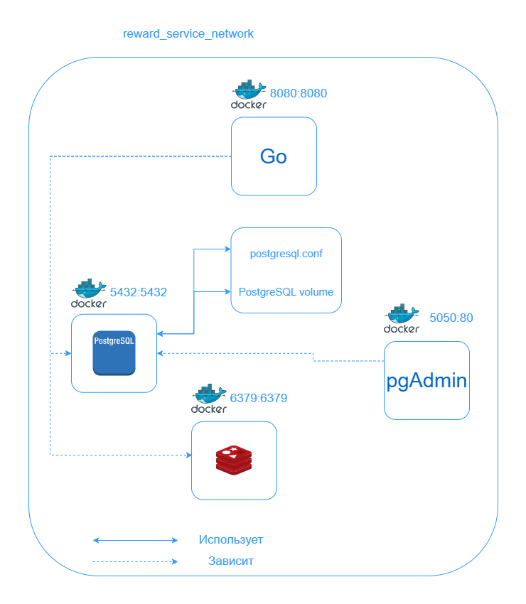

# **Тестовое задание для стажёра Backend (зимняя волна 2025)**

## **Работа с сервисом**

### Клонирование репозитория
```sh
git clone https://github.com/artrsyf/avito-trainee-assignment.git
cd avito-trainee-assignment
```

### Подготовка секретов
Необходимо создать .env файл в директории avito-trainee-assignment/cmd и перенести в нее енвы из .env.example

### Запуск проекта
```sh
make run
```

### Остановка проекта + удаление контейнеров, вольюмов
```sh
make drop
```

### Запуск unit-тестов
```sh
make unit_test
```

### Запуск интеграционных тестов
```sh
make integration_test
```

### Запуск e2e-тестов
```sh
make e2e_test
```

### Запуск линтера
```sh
make lint
```

### Справка
Можно узнать все доступные команды, а также их описание:
```sh
make help
```

## **Общее описание**
### Стек
В данном проекте используются Golang, PostgreSQL, Redis

### Структура проекта
- **/.github** - CI проекта
- **/cmd** - entrypoint приложения с енвами
- **/config** - конфиг приложения
- **/docker** - docker-файлы
- **/docs** - результаты покрытия тестами
- **/internal**
    - **/middleware** — мидлвары приложения
    - **/<сущность>**
        - **/delivery** — слой доставки
        - **/domain** — слой данных
        - **/repository** — слой доступа к данным
        - **/usecase** — слой бизнес-логики
- **/pkg** — дополнительные библиотеки
- **/postgres** — конфиг файл для PostgreSQL
- **/scripts** — миграция БД
- **/tests** — интеграционные, e2e и load-тесты

### Подход к архитектуре
Используется слоистая архитектура с разделением зон ответственности:
- Слой Repository отвечает за работу с хранилещем данных;
- Слой Usecase отвечает за бизнес-логику;
- Слой Delivery отвечает за обработку запросов-ответов;
- Слой Domain отвечает за представление данных.

Работа с инфраструктурой осуществляется через инверсию зависимостей.
<br>
Также работа с транзакциями осуществляется с помощью вспомогательной структуры - Unit Of Work.
Она предназначена для создания абстракции над транзакциями на уровне usecase, т.к. использование транзакций - непосредственно бизнес-логика, однако использование sql-адаптеров напрямую нарушает принцип разделения слоев.

### Работа с данными
Данные было принято разделить на три типа:
- DTO - данные, необходимые для передачи между слоями, пользовательские запросы и ответы;
- Entity - данные, отражающие сущности без привязки к инфраструктуре;
- Model - данные, соответствующие таблицам в БД.

### Структура БД


## **Структура Docker-сети**


## **Отчет о нагрузочном тестировании**


## **Анализ нагрузки на сервис**
При анализе результатов нагрузочного тестирования я заметил, что имеется в логах большое количество конкурентных обращений к транзакциям БД. Чтобы это исправить, я переработал подход с использованием паттерна Unit Of Work. Теперь каждой транзакции соответствует свой инстанс Unit Of Work, создаваемый через фабрику (принцип разделения слоев не нарушается). Это дало огромный выигрыш в работе системы на большом RPS. Результаты тестирования при 300 RPS:
```sh
     ✓ Auth succeeded
     ✗ SendCoin status is 200
      ↳  99% — ✓ 5020 / ✗ 3
     ✓ Info status is 200
     ✗ BuyItem status is 200
      ↳  99% — ✓ 4785 / ✗ 25

     █ setup

     checks.........................: 99.90% ✓ 29598      ✗ 28
     data_received..................: 24 MB  78 kB/s
     data_sent......................: 9.7 MB 32 kB/s
     http_req_blocked...............: avg=235.55µs min=29.06µs med=180.92µs max=127.01ms p(90)=321.11µs p(95)=388µs 

     http_req_connecting............: avg=174.51µs min=18.72µs med=123.72µs max=126.96ms p(90)=240.29µs p(95)=295.73µs
   ✓ http_req_duration..............: avg=203.11ms min=1.12ms  med=69.06ms  max=1.87s    p(90)=663.19ms p(95)=964.52ms
       { expected_response:true }...: avg=203.13ms min=1.61ms  med=69.06ms  max=1.87s    p(90)=663.24ms p(95)=964.91ms
   ✓ http_req_failed................: 0.08%  ✓ 28         ✗ 34598
     http_req_receiving.............: avg=111.03µs min=16.36µs med=96.04µs  max=12.51ms  p(90)=171.19µs p(95)=202.19µs
     http_req_sending...............: avg=48.94µs  min=4.37µs  med=35.78µs  max=27.54ms  p(90)=75.39µs  p(95)=96.07µs
     http_req_tls_handshaking.......: avg=0s       min=0s      med=0s       max=0s       p(90)=0s       p(95)=0s    

     http_req_waiting...............: avg=202.95ms min=1.03ms  med=68.88ms  max=1.87s    p(90)=663.05ms p(95)=964.37ms
     http_reqs......................: 34626  114.683616/s
     iteration_duration.............: avg=2.45s    min=2.05s   med=2.11s    max=1m0s     p(90)=3.32s    p(95)=3.47s 

     iterations.....................: 14813  49.061642/s
     vus............................: 3      min=0        max=300
     vus_max........................: 300    min=300      max=300


running (5m01.9s), 000/300 VUs, 14813 complete and 0 interrupted iterations
default ✓ [ 100% ] 000/300 VUs  4m0s
```

Видно, что система отрабатывает хорошо, но заметно потенциально проблемное место - CPU. Он при нагрузке ~300 RPS начинает работать на 100%, используя 11-12 доступных ядер (1100% нагрузка).
Результаты нагрузки системы при 300 RPS:


Результаты теста при 1000 RPS (заметна деградация ноды):
```sh
     ✗ Auth succeeded
      ↳  99% — ✓ 21726 / ✗ 67
     ✗ SendCoin status is 200
      ↳  93% — ✓ 6772 / ✗ 454
     ✗ Info status is 200
      ↳  89% — ✓ 6545 / ✗ 758
     ✗ BuyItem status is 200
      ↳  89% — ✓ 6476 / ✗ 788

     █ setup

     checks.........................: 95.25% ✓ 41519      ✗ 2067
     data_received..................: 32 MB  108 kB/s
     data_sent......................: 14 MB  46 kB/s
     http_req_blocked...............: avg=302.37µs min=26.95µs   med=164.44µs max=127.38ms p(90)=315.9µs  p(95)=444.29µs
     http_req_connecting............: avg=241.15µs min=16.67µs   med=111.61µs max=127.19ms p(90)=232.64µs p(95)=342.75µs
   ✓ http_req_duration..............: avg=1.19s    min=274.66µs  med=493.58ms max=7.48s    p(90)=3.54s    p(95)=4.6s

       { expected_response:true }...: avg=1.03s    min=1.46ms    med=433.87ms max=5.72s    p(90)=3.06s    p(95)=3.73s
   ✓ http_req_failed................: 4.25%  ✓ 2067       ✗ 46519
     http_req_receiving.............: avg=111.24µs min=-761236ns med=86.4µs   max=15.53ms  p(90)=156.57µs p(95)=192.96µs
     http_req_sending...............: avg=55.24µs  min=5.09µs    med=34.87µs  max=23.32ms  p(90)=71.64µs  p(95)=96.72µs
     http_req_tls_handshaking.......: avg=0s       min=0s        med=0s       max=0s       p(90)=0s       p(95)=0s  

     http_req_waiting...............: avg=1.19s    min=170.38µs  med=493.45ms max=7.48s    p(90)=3.54s    p(95)=4.6s

     http_reqs......................: 48586  162.362587/s
     iteration_duration.............: avg=4.64s    min=2.05s     med=4.37s    max=57.41s   p(90)=7.81s    p(95)=9.15s
     iterations.....................: 21793  72.826902/s
     vus............................: 5      min=0        max=1000
     vus_max........................: 1000   min=1000     max=1000


running (4m59.2s), 0000/1000 VUs, 21793 complete and 0 interrupted iterations
default ✓ [ 100% ] 0000/1000 VUs  4m0s
```

Результаты нагрузки системы при 1000 RPS:


## **Особенности**
1. В проект добавлен Redis, который используется для stateful проверки и контроля сессий;
2. Авторизация реализовывалась изначально под работу с access и refresh токенами, но из-за условия задания работы только с access-токеном используется только он с дефолтным значением жизни - 2 часа.
3. Отчет о покрытии unit-тестами (покрыты слои repository и usecase) расположен в папке docs.
4. Также в папке docs есть curls.txt файл, в котором хранятся ручные тесты на различные сценарии со следующей структурой:
    >
        <curl запрос>
        
        <код ответа>

        <тело ответа>
        ...

## **Выполненные задачи**
1. Реализована общая структура проекта в соответствии с условием;
2. Добавлены логи с logrus;
3. Написаны unit-, интеграционные, e2e- и load-тесты;
4. Приложение завернуто в докер, есть окружение для тестов;
5. Используется линтер;
6. Написан сценарий CI для автоматического прогона тестов и линтера;
7. Написан makefile для работы с проектом.